# Solució: Seguretat Lògica - Recuperant Accés a Sistemes

## Part 1: Recuperació d'Accés

### 1. Afegir el disc de la tasca

Aquí tenim el disc:

Afegim el disc de la tasca a la màquina virtual.

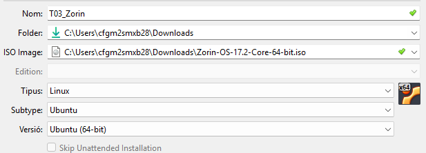

---

### 2. Canviar l'ordre d'execució

Cambiem l'ordre d'execució per assegurar que arrenca des del disc correcte.

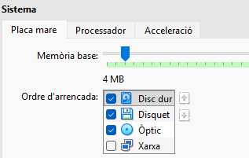

---

### 3. Accedir al menú GRUB

Després d'iniciar la màquina, la reiniciem (des de dins).

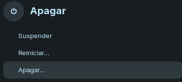

Seleccionem **opcions avançades**.

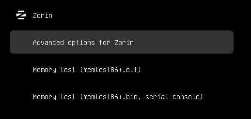

---

### 4. Mode de recuperació

Seleccionem l'**opció de recuperació**.

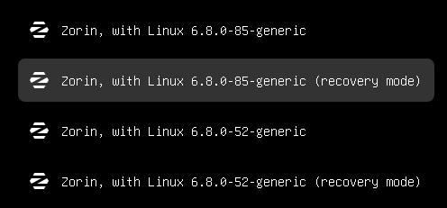

---

### 5. Accedir com a root

En aquest part seleccionem **root** i fem **Control + D**.

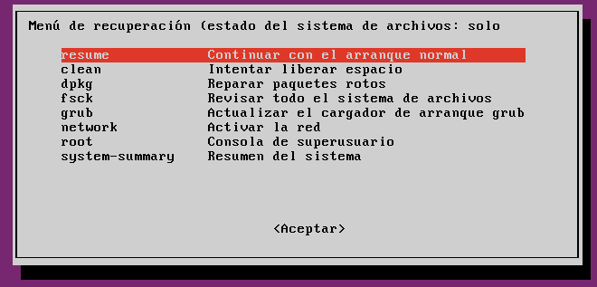

---

### 6. Canviar la contrasenya

Ara canviem la contrasenya i reiniciem el sistema.

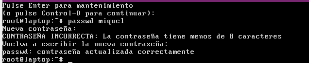

Així és com es reinicia la contrasenya.

---

## Part 2: Fortificació del GRUB

### 7. Generar hash de la contrasenya

Això és la comanda per transformar la teva contrasenya utilitzant hash:

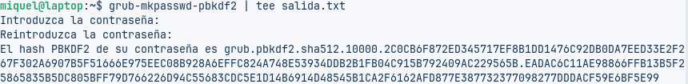

---

### 8. Editar el fitxer GRUB

Obrim el fitxer GRUB.

El guardem a "salida.txt".

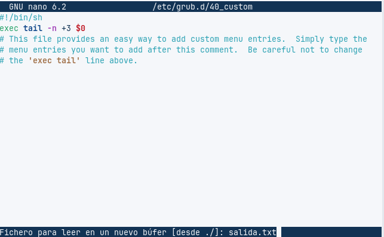

---

### 9. Configurar usuari i hash

Copies el hash.

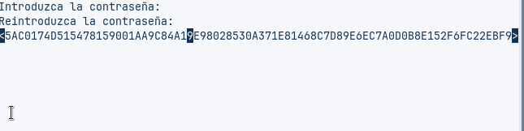

Poses el nom d'usuari desitjat i el hash al fitxer de configuració.

---

### 10. Actualitzar GRUB

Actualitzes el grub i fas un reboot.

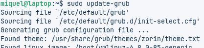

---

### 11. Verificació final

Introdueixes:
- El teu nom d'usuari
- Contrasenya

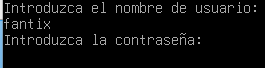

I ja està, això és la tasca.

---

## Conclusions

✅ S'ha recuperat l'accés al sistema canviant la contrasenya

✅ S'ha fortificat el GRUB amb protecció per contrasenya

✅ El sistema ara està protegit contra accessos no autoritzats

---

[⬅️ Tornar a la pàgina de la Tasca 3](./README.md) | [🏠 Tornar al repositori principal](../README.md)
