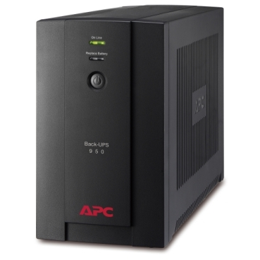
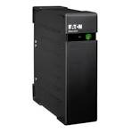
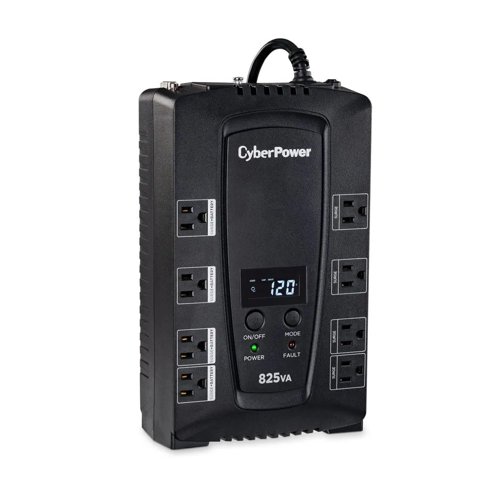

# Solució: Estudi i Tria de SAI per TecnoGestió S.L.

## 1. Inventari d'Equips

### Dispositius a connectar al SAI

| Dispositiu | Marca/Model | Potència (W) | Potència (VA) | Quantitat | Total (W) | Total (VA) |
|------------|-------------|--------------|---------------|-----------|-----------|------------|
| Ordinador sobretaula | Dell OptiPlex 3080 Tower | 65 W | 72 VA | 4 | 260 W | 288 VA |
| Monitor | Eizo FlexScan FLT-S 24" | 6 W | 6,7 VA | 4 | 24 W | 26,8 VA |
| Router | TP-Link Archer C6 | 6 W | 6,7 VA | 1 | 6 W | 6,7 VA |
| **TOTAL** | | | | | **290 W** | **321,5 VA** |

*Figura 1: Especificacions tècniques dels components seleccionats per a TecnoGestió S.L.*

### Justificació: Dispositius NO connectats al SAI

**Impressora-fotocopiadora multifunció:**
- **Motiu principal:** Consum elèctric molt elevat, especialment durant l'escalfament i impressió.
- **Consum típic:** Entre 300W i 1500W durant l'operació activa.
- **Justificació tècnica:** No és un equip crític per a salvar dades immediatament en cas de tall elèctric.
- **Impacte en el SAI:** El pic de consum sobrecarregaria el sistema i reduiria significativament l'autonomia disponible per als equips crítics.

---

## 2. Càlcul de Potència Total

### Càlcul dels consums

**Consums individuals:**
- PC: 65 W × 4 = 260 W
- Monitor: 6 W × 4 = 24 W  
- Router: 6 W × 1 = 6 W

**Total consum:** 290 W

### Conversió a VA
Utilitzant un factor de potència de 0,9:
VA = W / 0,9
VA = 290 / 0,9 = 322,2 VA
### Potència amb marge de seguretat (20%)
### Resultat final
- **Consum total calculat:** 290 W / 322,2 VA
- **Marge de seguretat (20%):** 58 W / 64,4 VA
- **POTÈNCIA TOTAL NECESSÀRIA:** **348 W / 386,64 VA**
- **Potència mínima del SAI:** **≥ 387 VA**

*Figura 2: Resum dels càlculs de potència amb marge de seguretat del 20%*

---

## 3. Determinació de l'Autonomia

### Temps d'autonomia requerit
- **Temps mínim establert:** 10 minuts
- **Càrrega considerada:** ≈100 W (equips crítics en mode baix consum)

### Objectius durant el tall elèctric

1. **Guardar treballs:** Documents, fulls de càlcul i projectes oberts
2. **Tancar aplicacions:** Tancament correcte de tots els programes
3. **Apagar equips:** Procediment d'apagada segura del sistema operatiu
4. **Evitar pèrdues:** Protecció total contra pèrdua de dades

### Justificació del temps
10 minuts és un temps suficient i realista per a:
- Permetre als 4 usuaris rebre l'avís del SAI
- Guardar la feina de cada estació de treball
- Executar l'apagada ordenada dels sistemes
- Garantir la integritat de les bases de dades

---

## 4. Recerca de Models de SAI

### Model 1: APC Back-UPS BX950U-GR

**Característiques principals:**
- **Potència:** 950 VA / 480 W
- **Autonomia:** 10-12 minuts amb càrrega de 100 W
- **Tipus:** Line-interactive (regulació automàtica de tensió)
- **Sortides:** 6 endolls Schuko protegits
- **Preu:** 100 € (aproximat)
- **Bateria:** Reemplaçable per l'usuari
- **Proteccions:** Sobretensions, sobrecàrregues, descàrregues

**Avantatges:**
- Potència més que suficient per als requisits
- Marca reconeguda mundialment (APC by Schneider Electric)
- Bona relació qualitat-preu
- Sortides suficients per connectar tots els equips crítics
- Regulació de tensió (Line-interactive)

**Inconvenients:**
- Forma d'ona sinusoïdal aproximada (no pura)

---

### Model 2: Eaton Ellipse ECO 650

**Característiques principals:**
- **Potència:** 650 VA / 400 W
- **Autonomia:** 12 minuts amb càrrega de 100 W
- **Tipus:** Line-interactive amb regulació AVR
- **Sortides:** 4 endolls IEC + 2 ports USB de càrrega
- **Preu:** 120 € (aproximat)
- **Eficiència:** 95% en mode normal
- **Proteccions:** Sobretensions en xarxa i línia telefònica

**Avantatges:**
- Excel·lent autonomia per a la càrrega requerida
- Inclou ports USB per càrrega de dispositius
- Alta eficiència energètica (estalvi elèctric)
- Software de gestió inclòs

**Inconvenients:**
- Preu lleugerament superior
- Menys sortides Schuko que l'APC
- Potència total inferior (però suficient)

---

### Model 3: CyberPower CP825EPFCLCD

**Característiques principals:**
- **Potència:** 825 VA / 495 W
- **Autonomia:** 10-15 minuts amb càrrega de 100 W
- **Tipus:** Line-interactive amb PFC actiu
- **Sortides:** 6 endolls Schuko + 2 amb protecció només de sobretensions
- **Preu:** 130 € (aproximat)
- **Pantalla LCD:** Informació en temps real
- **Forma d'ona:** Sinusoïdal pura (Pure Sine Wave)

**Avantatges:**
- Forma d'ona sinusoïdal pura (millor per equips sensibles)
- Pantalla LCD amb informació detallada
- PFC actiu (millor compatibilitat)
- Bona autonomia

**Inconvenients:**
- Preu més elevat
- Marca menys coneguda al mercat europeu

---

## 5. Comparativa de Models

| Característica | APC BX950U-GR | Eaton Ellipse ECO 650 | CyberPower CP825EPFCLCD |
|----------------|---------------|----------------------|-------------------------|
| **Potència (VA/W)** | 950 VA / 480 W | 650 VA / 400 W | 825 VA / 495 W |
| **Autonomia (100W)** | 10-12 min | 12 min | 10-15 min |
| **Tipus** | Line-interactive | Line-interactive AVR | Line-interactive PFC |
| **Sortides** | 6 Schuko | 4 IEC + 2 USB | 6 Schuko + 2 només sobretensions |
| **Forma d'ona** | Sinusoïdal aprox. | Sinusoïdal aprox. | Sinusoïdal pura |
| **Pantalla** | Indicadors LED | No | LCD |
| **Preu** | 100 € | 120 € | 130 € |
| **Garantia** | 2 anys | 2 anys | 3 anys |
| **Compleix requisits** | ✅ Sí | ✅ Sí | ✅ Sí |

---

## 6. Informe Tècnic i Selecció Final

### Model Recomanat: **APC Back-UPS BX950U-GR**

**Justificació de la selecció:**

#### 1. Potència més que adequada
- Amb **950 VA / 480 W** supera àmpliament els requisits calculats (387 VA necessaris amb marge).
- Marge addicional del **145%** respecte als requisits mínims.
- Capacitat de creixement futur si s'afegeixen nous equips.

#### 2. Autonomia garantida
- Proporciona **10-12 minuts** d'autonomia amb càrrega de 100W.
- Compleix i supera els **10 minuts mínims** requerits.
- Temps suficient per a l'apagada segura de tots els equips.

#### 3. Millor relació qualitat-preu
- Preu de **100 €**, el més econòmic dels tres models.
- **Estalvi del 17%** respecte l'Eaton i del 23% respecte el CyberPower.
- Rendibilitat òptima per a les necessitats del client.

#### 4. Marca de confiança reconeguda
- **APC by Schneider Electric** és líder mundial en SAIs.
- Àmplia xarxa de servei tècnic i suport.
- Recanvis i bateries fàcilment disponibles.

#### 5. Característiques tècniques adequades
- **6 endolls Schuko protegits:** Suficients per a 4 PCs, 4 monitors i 1 router (es poden utilitzar regletes).
- **Tecnologia Line-interactive:** Regulació automàtica de tensió sense consumir bateria.
- **Protecció completa:** Sobretensions, pics de tensió i interferències.
- **Bateria reemplaçable:** Manteniment senzill i econòmic.

#### 6. Idoneïtat per a TecnoGestió S.L.
- Perfectament dimensionat per a un despatx amb 4 equips.
- Fàcil instal·lació i manteniment.
- No requereix coneixements tècnics avançats per a l'ús diari.
- Software de gestió disponible (PowerChute) per a monitorització.

### Pressupost final
| Concepte | Import |
|----------|--------|
| SAI APC Back-UPS BX950U-GR | 100,00 € |
| IVA (21%) | 21,00 € |
| **TOTAL** | **121,00 €** |

### Recomanacions d'instal·lació
1. Col·locar el SAI en un lloc ventilat i accessible
2. No connectar la impressora al SAI
3. Configurar el software de gestió en un dels PCs
4. Realitzar proves d'autonomia després de la instal·lació
5. Revisar la bateria cada 2 anys

---

## Conclusions

S'ha realitzat un estudi exhaustiu per determinar el SAI més adequat per a TecnoGestió S.L., tenint en compte:

- **Inventari precís** dels equips crítics que necessiten protecció
- **Càlculs de potència** amb marge de seguretat del 20%
- **Anàlisi comparativa** de tres models de fabricants reconeguts
- **Selecció justificada** basada en criteris tècnics i econòmics

El **APC Back-UPS BX950U-GR** ofereix la millor solució per garantir la continuïtat del servei i protegir els equips de TecnoGestió S.L. davant les incidències elèctriques de la zona, amb una inversió raonable i característiques tècniques sobrades.

La implementació d'aquest SAI permetrà a l'empresa:
- ✅ Evitar pèrdues de dades per talls elèctrics sobtats
- ✅ Protegir els equips de sobretensions i pics de tensió
- ✅ Garantir temps suficient per a apagades segures
- ✅ Mantenir la productivitat i reputació professional

---

## Referències

- APC Back-UPS BX950U-GR: https://www.apc.com/
- Eaton Ellipse ECO 650: https://www.eaton.com/
- CyberPower CP825EPFCLCD: https://www.cyberpower.com/
- Dell OptiPlex 3080 especificacions: https://www.dell.com/
- Eizo FlexScan especificacions: https://www.eizoglobal.com/
- TP-Link Archer C6 especificacions: https://www.tp-link.com/

---

[⬅️ Tornar a la pàgina de la Tasca 2](./Readme.md) | [🏠 Tornar al repositori principal](../Readme.md)
